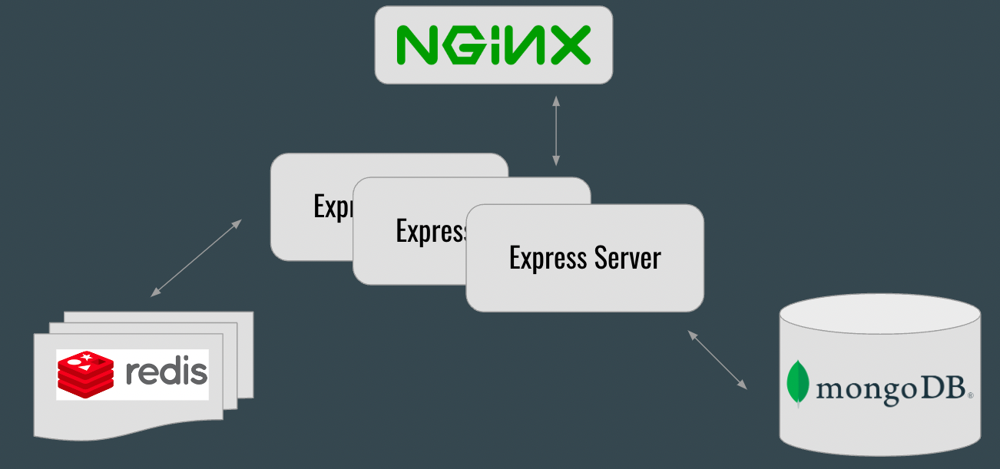
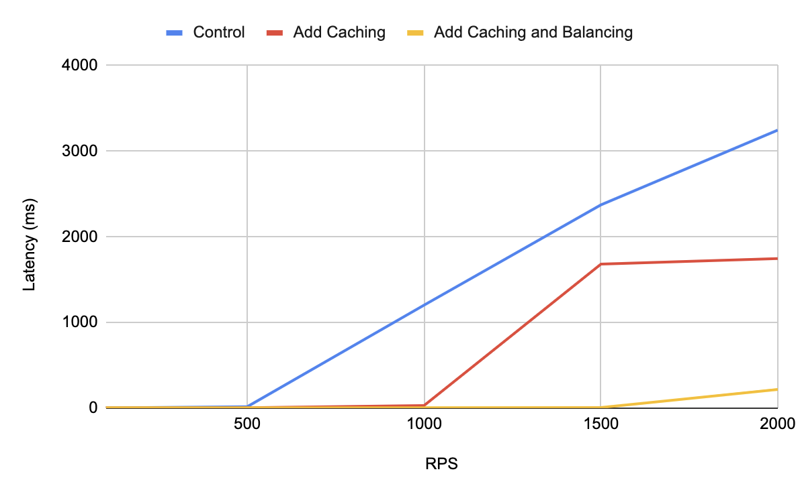

# Q&A Microservice API
This is a microservice for a product questions and answers API I built for an eCommerce site. I inherited a monolithic legacy code base and the goal was to have it handle production traffic (SLAs: >100 RPS at all times, <1% error rate, and <2 s latency at all times, but also handling spikes >>100 RPS).

## Database Choice
I opted for mongoDB after studying the use case: the shape and size of the data, the endpoints' performance needs, and how the inherited API was being used by the client.

## Stress Testing and Optimization
Express server routes were first optimized iteratively using K6 for local stress testing. Iterative changes to system architecture were tested using loader.io for stress testing and monitored on New Relic after deployment on AWS EC2s. Signiticant performance enhancements were achieved with caching using Redis and an NGINX load balancer across 3 express servers.

  

## Performance Enhancements
API could easily handle spikes of 2000 RPS on the most heavily trafficked endpoints with 16 ms average latency. Overall I achieved a 99% and 93% decrease in latency at 2000 RPS for the two main <kbd>GET</kbd> endpoints.

  

## Future Enhancements
Project requirements specified the size of AWS EC2s. Future enhancements of this microservice would test vertical scaling against existing architecture.